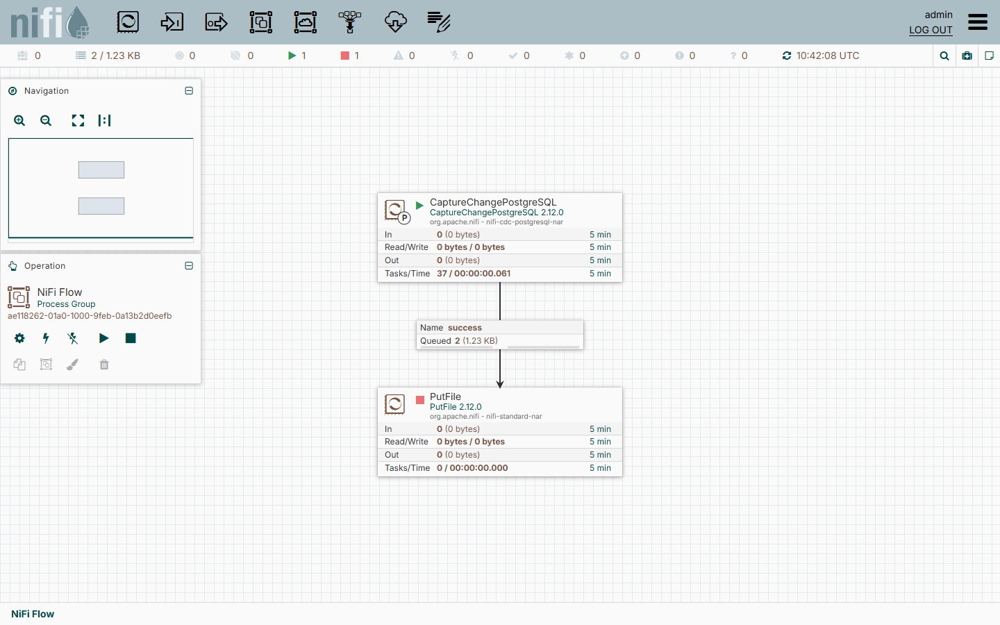
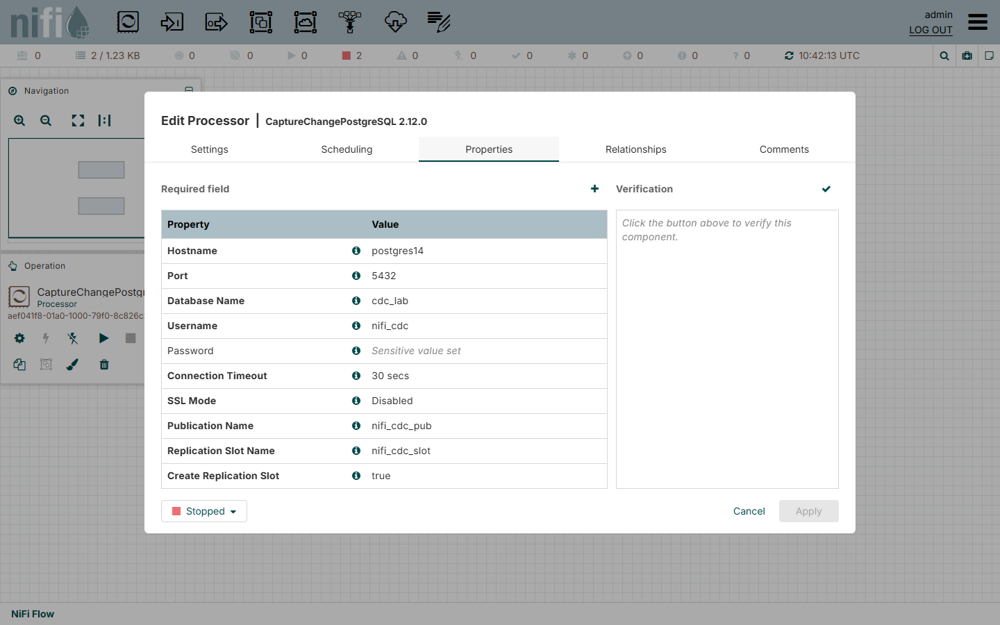
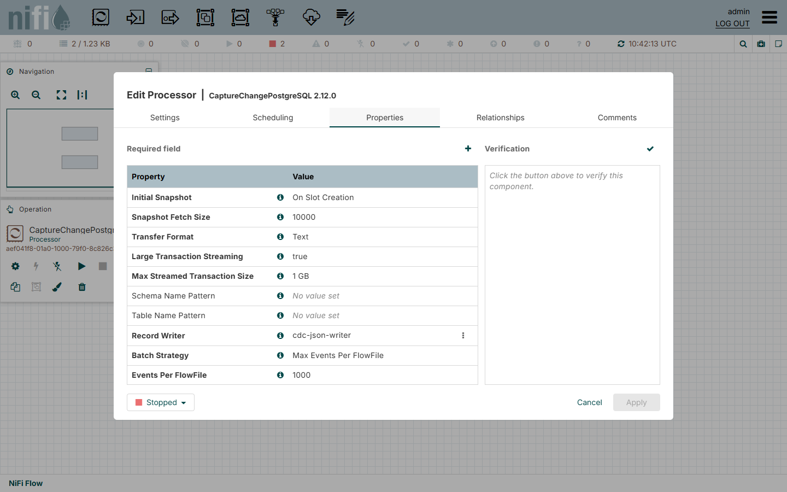
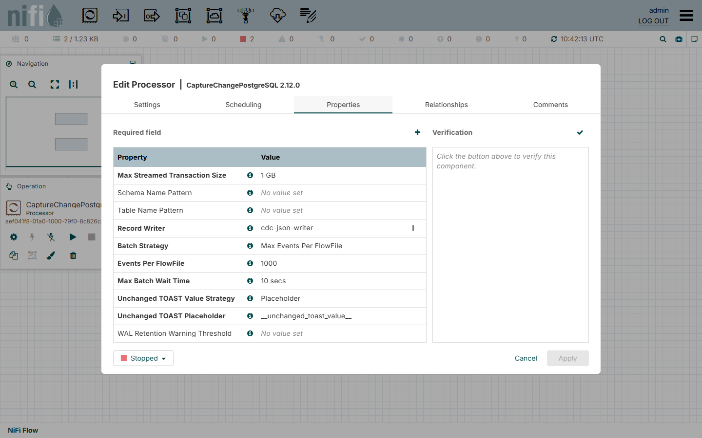
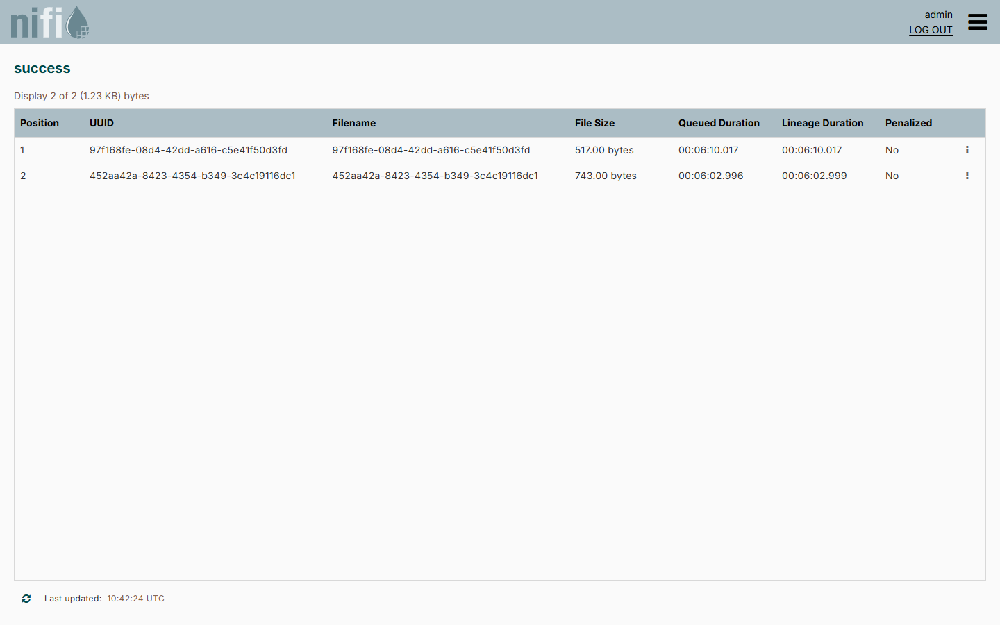
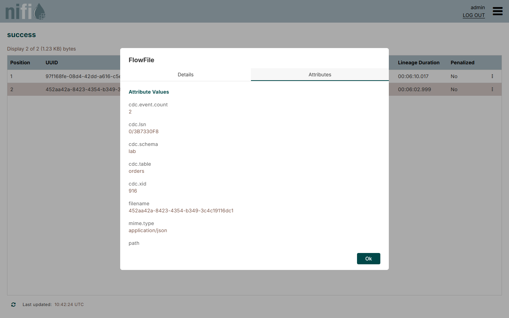
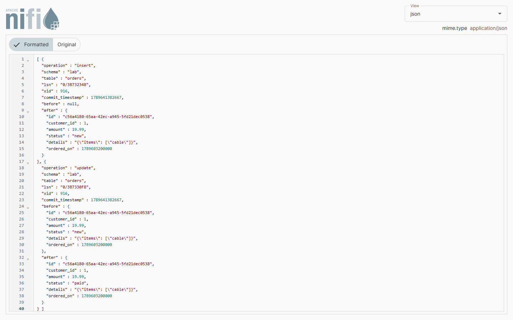

<!--
  Licensed to the Apache Software Foundation (ASF) under one or more
  contributor license agreements.  See the NOTICE file distributed with
  this work for additional information regarding copyright ownership.
  The ASF licenses this file to You under the Apache License, Version 2.0
  (the "License"); you may not use this file except in compliance with
  the License.  You may obtain a copy of the License at
      http://www.apache.org/licenses/LICENSE-2.0
  Unless required by applicable law or agreed to in writing, software
  distributed under the License is distributed on an "AS IS" BASIS,
  WITHOUT WARRANTIES OR CONDITIONS OF ANY KIND, either express or implied.
  See the License for the specific language governing permissions and
  limitations under the License.
-->
# NiFi PostgreSQL CDC Bundle

`CaptureChangePostgreSQL` is an Apache NiFi 2.x processor that captures INSERT, UPDATE, DELETE and TRUNCATE events
from PostgreSQL through logical replication (`pgoutput`) and writes them as records with a Record Writer, optionally
after an initial snapshot of the existing rows.

The module follows the layout and conventions of `nifi-extension-bundles/nifi-cdc` in Apache NiFi and is intended
as a contribution for [NIFI-4239](https://issues.apache.org/jira/browse/NIFI-4239).

## Requirements

- Apache NiFi 2.12.0, Java 21
- PostgreSQL 14 or later with `wal_level = logical`
- A database user with the `REPLICATION` privilege and a publication for the tables to capture

## Installation

1. Download `nifi-cdc-postgresql-nar-2.12.0.nar` from the [releases](https://github.com/danmorcov88/nifi-cdc-postgresql-bundle/releases)
   or build it with `./mvnw package`.
2. Copy the NAR into the `lib/` directory of NiFi (or into the NAR auto-load directory, `nar_extensions/` in the
   Docker image) and start NiFi.
3. Prepare the server:

   ```sql
   CREATE ROLE nifi_cdc WITH LOGIN REPLICATION PASSWORD '...';
   CREATE PUBLICATION nifi_cdc_pub FOR TABLE inventory.products, inventory.orders;
   GRANT SELECT ON inventory.products, inventory.orders TO nifi_cdc;
   ```

4. Add `CaptureChangePostgreSQL` to the canvas, set the connection properties, the publication, a slot name and a
   Record Writer (for example `JsonRecordSetWriter`). The slot is created on first start.

The processor documentation (Usage in the NiFi UI) describes the server settings, the record layout, the type
mapping and the operational notes, in particular the write-ahead log that a replication slot retains while the
processor is stopped.

## How it looks

The processor connected to a `PutFile`, with the FlowFiles it produced queued between them:



Connection properties, capture options (initial snapshot, transfer format, streaming of large transactions) and
output properties:







One FlowFile per table and batch, with the `cdc.*` attributes; here the snapshot of `lab.customers` taken when the
slot was created, followed by the changes of `lab.orders`:





The content of a FlowFile written by `JsonRecordSetWriter`, here an insert followed by an update of the same row in
`lab.orders` (`REPLICA IDENTITY FULL`, so the update carries the full `before` image):



## Example flow

[examples/capture-change-postgresql.json](examples/capture-change-postgresql.json) is a flow definition with the
processor, a `JsonRecordSetWriter` and a funnel as placeholder for the consumer. Import it with *Upload* from the
process group menu, enable the writer service and set the password of the database user.

A record for an update of `inventory.products` looks like this:

```json
{
  "operation": "update",
  "schema": "inventory",
  "table": "products",
  "lsn": "0/1783488",
  "xid": 775,
  "commit_timestamp": 1789631150727,
  "before": null,
  "after": { "id": 600, "name": "Widget", "price": 2.00, "active": true }
}
```

## Build

```
./mvnw verify                        # compile, unit tests, NAR
./mvnw verify -P contrib-check       # same, plus the upstream RAT, checkstyle and PMD checks
./mvnw verify -P integration-tests   # also runs the Testcontainers suite against PostgreSQL 14 and 18 (needs Docker)
```

The NAR is produced at `nifi-cdc-postgresql-nar/target/nifi-cdc-postgresql-nar-2.12.0.nar`.

## Development lab

`docker-compose.yml` starts PostgreSQL 14 and 18 configured for logical replication (ports 5414 and 5418, with a
small `logical_decoding_work_mem` so that transactions of a few thousand rows are streamed) with a replication user,
two tables and a publication (`docker/init/01-init.sql`), and a NiFi 2.12.0 container that loads the built NAR:

```
docker compose up -d postgres14 postgres18
./mvnw package
docker compose --profile nifi up -d          # https://localhost:8443/nifi  (admin / adminadminadmin)
```

`docker/capture-fixtures.sh` records pgoutput messages from both servers, in text and in binary format and with
protocol version 2 streaming, into `nifi-cdc-postgresql-processors/src/test/resources/pgoutput/`; the decoder tests
run against these recordings.

## Status

Working and covered by unit and integration tests: change capture, initial snapshot, binary transfer format and
streaming of large transactions (pgoutput protocol version 2).

## License

Apache License 2.0. The NAR bundles the PostgreSQL JDBC driver (BSD-2-Clause); see `META-INF/LICENSE` in the NAR.
